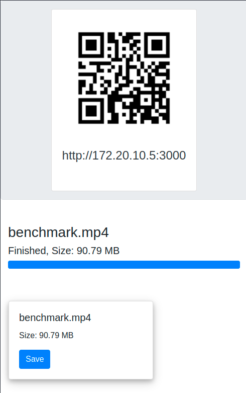

# Easy Share

simple application to Transfer Files between devices

<br>

<p align="center"> 



</p>
<br>
<br>

## Features

- Scan qrcode with mobile, and send Files!
- Run on computer and use in other devices!

## Installation

```bash
git clone https://github.com/alipirpiran/easy_share.git
cd easy_share
npm i & npm run build
./out/easy_share
```

## Usage

1. Connect devices to a network (Eg: mobile hotspot)

2. run Easy Share

3. open generated URL in mobile browser (or simply scan qrcode)

4. send files from mobile !

## Technologies Used

- Socket.IO
- express js
- nexe

## Contributing

### Building

```bash
git clone https://github.com/alipirpiran/easy_share.git
cd easy_share
npm i & npm run build
```
